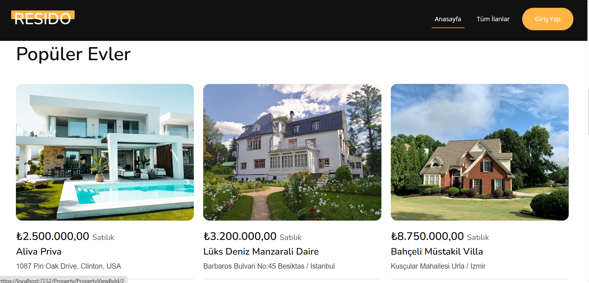
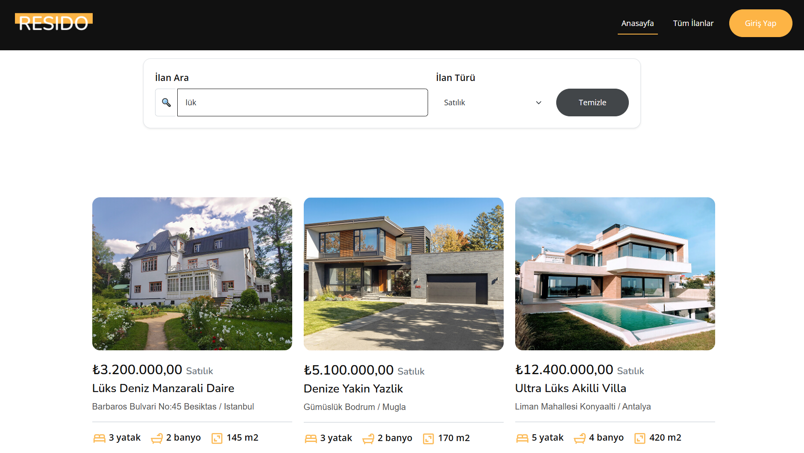
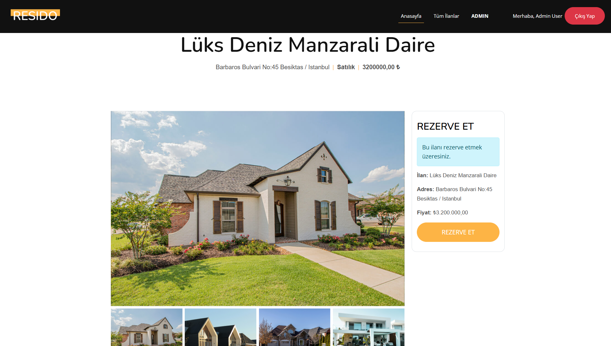
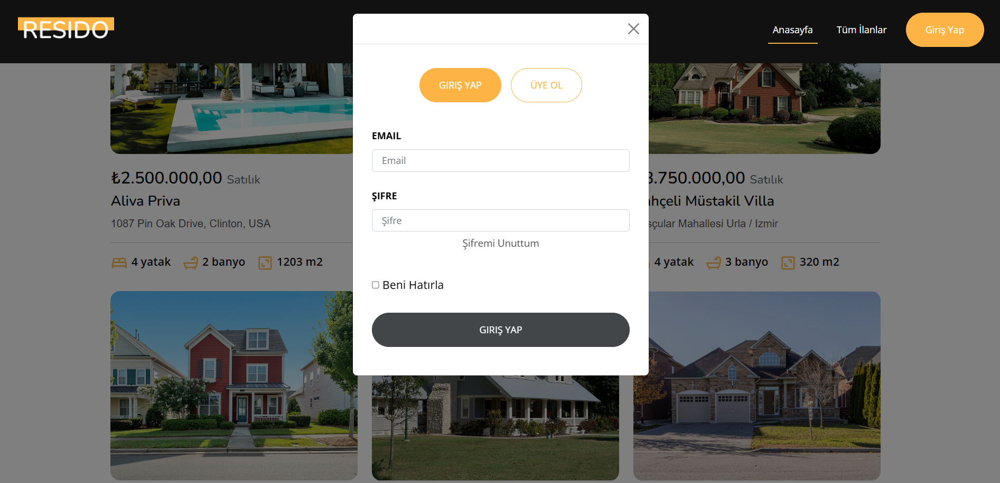
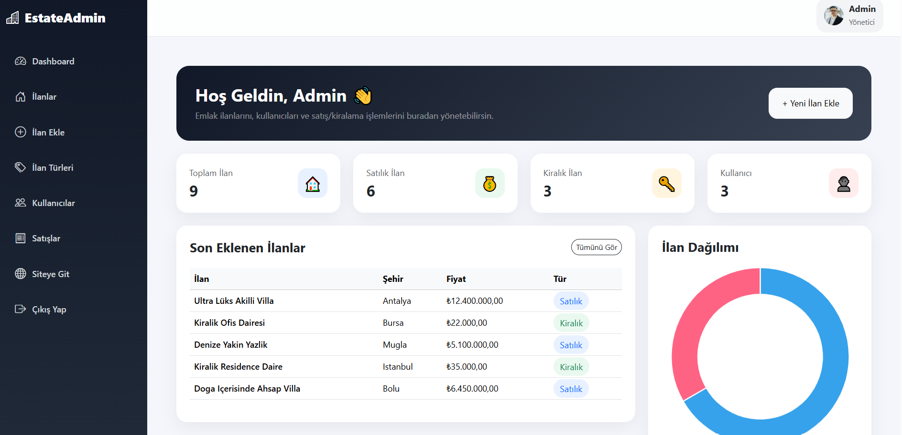
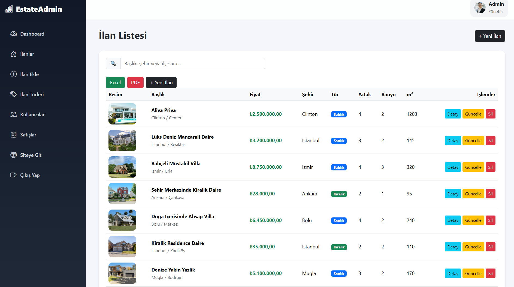
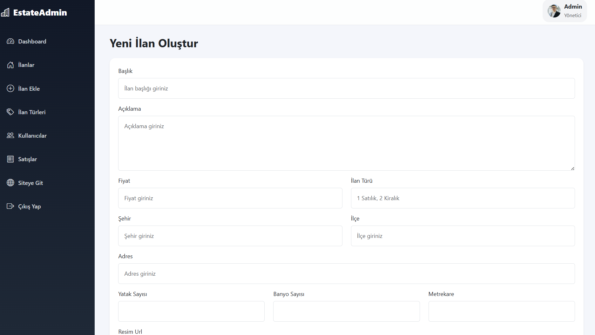
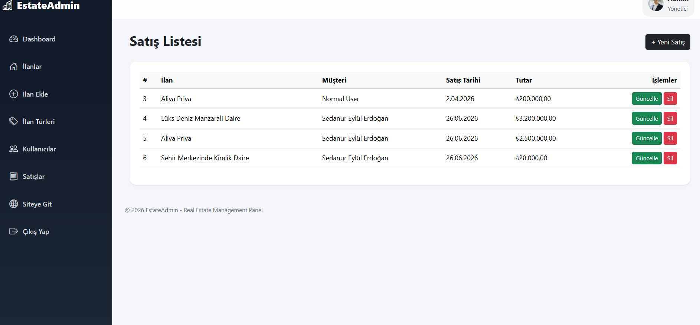
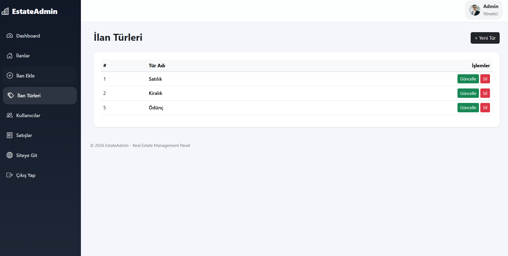
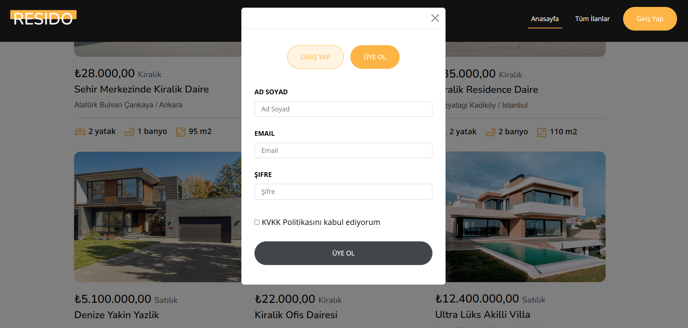

<!-- HEADER -->

<div align="center">

# 🏡 Dapper Real Estate

### Modern Real Estate Management System with ASP.NET Core MVC, Dapper & SQL Server

A modern real estate management application built using ASP.NET Core MVC, Dapper, SQL Server and Bootstrap. The project includes property management, customer management, sales management, role-based login, reporting dashboard, PDF & Excel export features using Stored Procedures.

---


</div>

---

# 📸 Project Screenshots

## Home Page


---
## Home Property



---

## Property Listing



---

## Property Detail



---

## Login Page



---

## Admin Dashboard



---

## Property Management



---
## Create Property 



---

## Sales Management



---

## Property Type Management



---
## Register Page



---

# 🚀 Project Features

### 🏡 Customer Side

- Home Page
- Property Listing
- Property Detail Page
- Property Search
- Property Filtering
- Responsive Design

---

### 🛠 Admin Panel

- Dashboard
- Property CRUD
- Customer CRUD
- Sales CRUD
- Property Type CRUD
- Login Authentication
- PDF Export
- Excel Export

---

### 📊 Reporting Dashboard

- Total Properties
- Total Customers
- Total Sales
- Property Statistics
- Latest Properties
- Property Type Distribution
- Modern Dashboard Cards
- Responsive Admin Panel

---

# 🏗 Project Architecture

```text
DapperRealEstate

│

└── ASP.NET Core MVC

    ├── Dapper

    ├── SQL Server

    ├── Stored Procedures

    ├── Bootstrap 5

    ├── Razor Views

    ├── JavaScript

    ├── QuestPDF

    └── EPPlus
```

---

# 🛠 Technologies

| Backend | Frontend | Database | Other |
|----------|----------|----------|--------|
| ASP.NET Core MVC | Bootstrap 5 | SQL Server | Dapper |
| C# | HTML5 | Stored Procedures | QuestPDF |
| Razor | CSS3 | MSSQL LocalDB | EPPlus |
| MVC Pattern | JavaScript | Relational Database | Session Authentication |
| CRUD Operations | Responsive Design | | LINQ |

---

# 📊 Modules

✔ Login System

✔ Session Authentication

✔ Dashboard

✔ Property Management

✔ Customer Management

✔ Sales Management

✔ Property Type Management

✔ Property Search

✔ Property Filtering

✔ Stored Procedure Operations

✔ PDF Report Export

✔ Excel Report Export

✔ Responsive Admin Panel

---

# 📂 Database Tables

| Table |
|---------|
| Users |
| Roles |
| Properties |
| PropertyTypes |
| Sales |

---

# ⚡ Stored Procedures

### Users

- UserViewAll
- UserViewById
- UserInsert
- UserUpdate
- UserDelete
- UserLogin

---

### Properties

- PropertyViewAll
- PropertyViewById
- PropertyInsert
- PropertyUpdate
- PropertyDelete

---

### Property Types

- PropertyTypeViewAll
- PropertyTypeViewById
- PropertyTypeInsert
- PropertyTypeUpdate
- PropertyTypeDelete

---

### Sales

- SaleViewAll
- SaleViewById
- SaleInsert
- SaleUpdate
- SaleDelete

---

### Roles

- RoleViewAll
- RoleViewById
- RoleInsert
- RoleUpdate
- RoleDelete

---

# 🎯 Learning Outcomes

- ASP.NET Core MVC
- Dapper ORM
- SQL Server
- Stored Procedures
- Session Authentication
- CRUD Operations
- Dashboard Design
- PDF Report Generation
- Excel Report Generation
- Bootstrap 5
- JavaScript Filtering
- Responsive Web Design

---

# ⭐ Project Status

✅ Completed

---

<div align="center">

Made with ❤️ using ASP.NET Core MVC & Dapper

</div>
